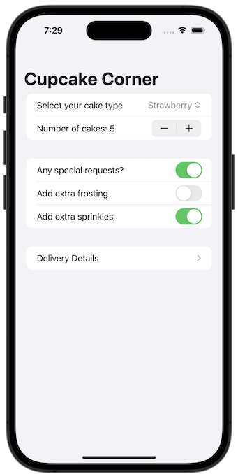
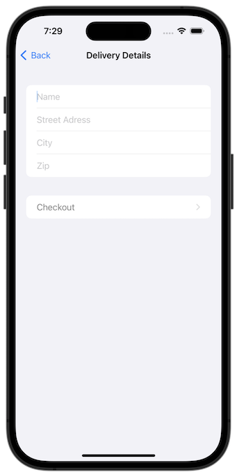
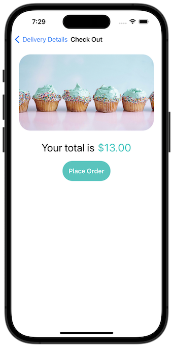

# Project 15 - Challenge 1

https://www.hackingwithswift.com/books/ios-swiftui/accessibility-wrap-up

## Challenges

From [Hacking with Swift](https://www.hackingwithswift.com/books/ios-swiftui/accessibility-wrap-up):

> The check out view in Cupcake Corner uses an image and loading spinner that don’t add anything to the UI, so find a way to make the screenreader not read them out.

## Screenshots

