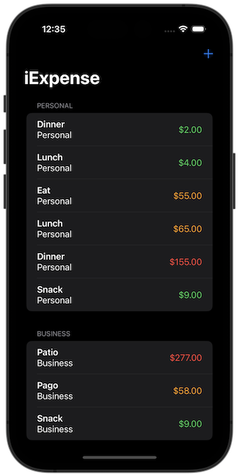
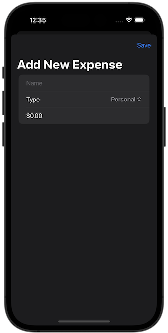
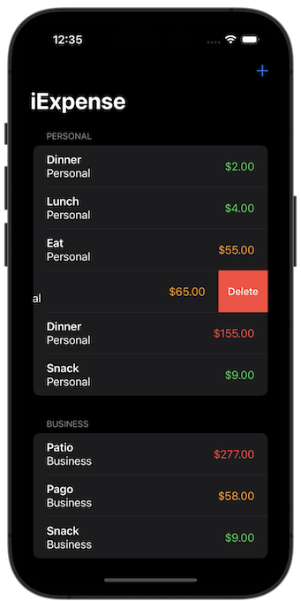

# Project 15 - Challenge 2

https://www.hackingwithswift.com/books/ios-swiftui/accessibility-wrap-up

## Challenges

From [Hacking with Swift](https://www.hackingwithswift.com/books/ios-swiftui/accessibility-wrap-up):

> Fix the list rows in iExpense so they read out the name and value in one single VoiceOver label, and their type in a hint.

## Screenshots

