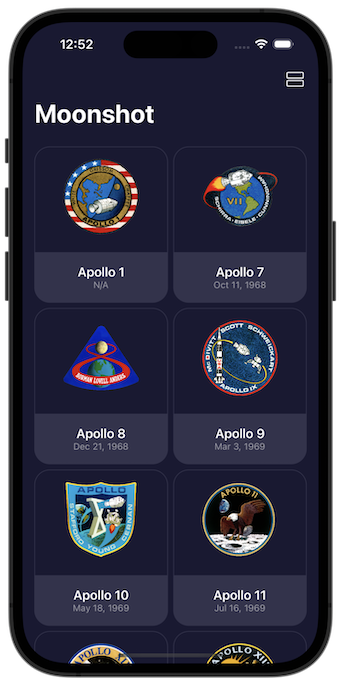
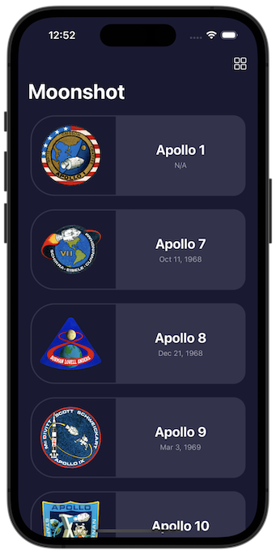
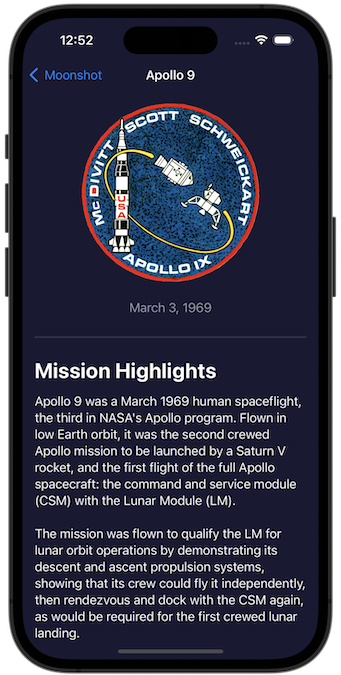
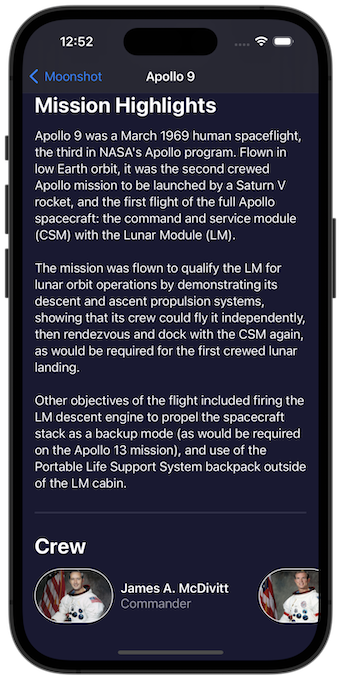
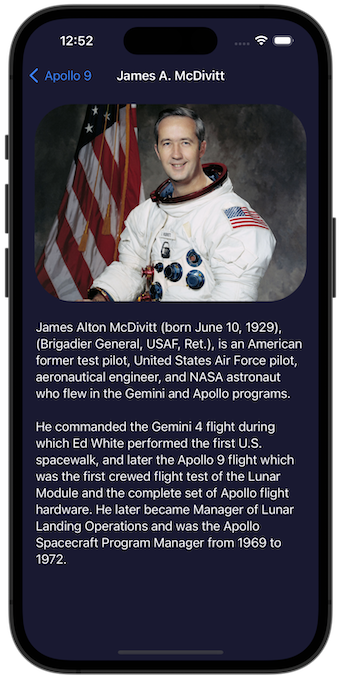

# Project 15 - Challenge 3

https://www.hackingwithswift.com/books/ios-swiftui/accessibility-wrap-up

## Challenges

From [Hacking with Swift](https://www.hackingwithswift.com/books/ios-swiftui/accessibility-wrap-up):

> Do a full accessibility review of Moonshot – what changes do you need to make so that it’s fully accessible?

## Screenshots

