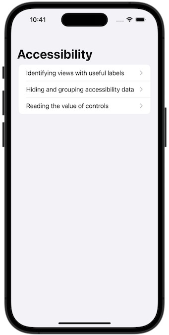
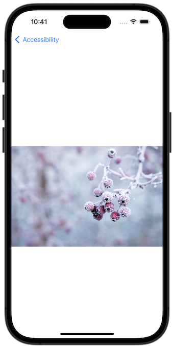
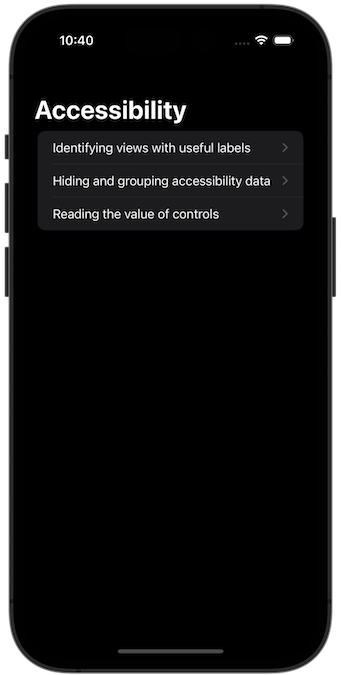
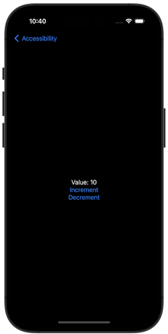

# Project 15 - Accessibility VoiceOver

https://www.hackingwithswift.com/100/swiftui/74

Includes solutions to the [challenges](https://www.hackingwithswift.com/books/ios-swiftui/accessibility-wrap-up).

## Topics

Accessibility, Voice Over

## Challenges

From [Hacking with Swift](https://www.hackingwithswift.com/books/ios-swiftui/accessibility-wrap-up):

1. [Challenge 1](Challenge1/)
2. [Challenge 2](Challenge2/)
3. [Challenge 3](Challenge3/)

## Screenshots

### Light Mode

### Dark Mode

